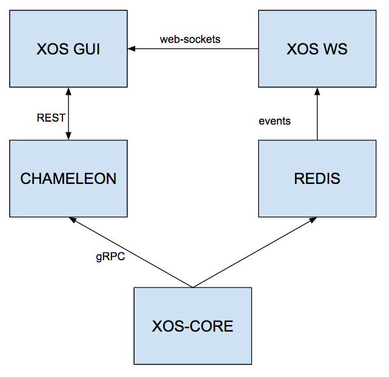

# Architectural Overview

This chapter will guide you trough the general architecture of the XOS User Interfaces

## Ecosystem

The XOS GUI is design to work in the XOS ecosystem, taking advantages of some of the features exposed by it.
As an example the application is designed to discover the models registered in XOS 
and auto-generate CRUD views for all of them, feature that is available thanks to our xProto modeling language.
We are also leveraging the XOS-WS component, build on top of our Redis based pub-sub system, to provide a progressive caching mechanism.

The GUI ecosystem in XOS is composed by a pod of 5 Docker containers that comunicate as per the following diagram:

We'll talk deeper about the data flow in the [Developer Guide](../developer/README.md) but here is the main role of each component:

#### XOS-CORE
Is hosting the entire data-model and expose a `gRPC` API layer to let other components interact with the data model.

#### CHAMELEON
Chameleon is reponsible to expose a description of the models stored in `XOS-CORE` and to provide the bindings between `REST` and `gRPC`

#### REDIS
It is hosting a `redis` server used as primary pub-sub mechanism in the system

#### XOS-WS
Listen to `redis` events and transform them into `web-sockets` events in order to keep `XOS-GUI` updated

#### XOS-GUI
Is hosting the GUI SPA and exposing it to the world through a web-server, in this case `nginx`