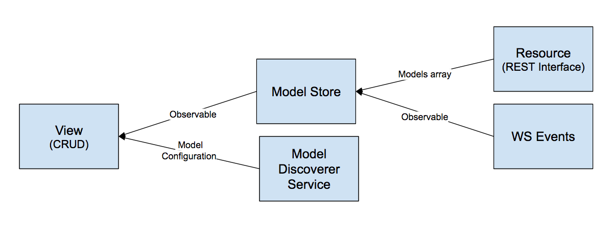

# The Data Sources module and the observable pattern

The Data Source module is the actual glue between the Single Page Application and XOS and is responsible to keep data up to date in the UI. It use a combination of REST APIs (used to fetch the initial data) and Websocket events (used to incrementally extend those data) and create a set of Observables.

An observable is basically a sequence of ongoing events ordered in time, to know more about this topics you can start here: [The introduction to Reactive Programming you've been missing](https://gist.github.com/staltz/868e7e9bc2a7b8c1f754)

The way synchronization is achieved follow this pattern:
- When the application is loaded we read all the core model definition from the backend
- For each Core Model 
    - we read the existing data
    - we store them in an Observable
    - we generate a configuration for tables and forms 
- Any view that need those data require the Model Observable and the Model Configuration
- For any Websocket event we trigger a new event in the related Observable

You can see an example of this behavior in `/src/app/views/crud/crud.ts`.
This view is responsible to auto-generate a CRUD interface for each model in the system.